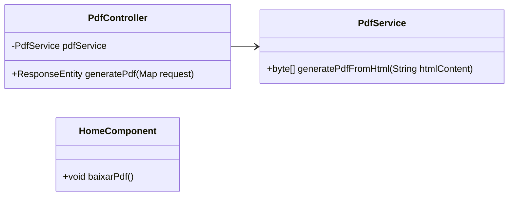

# Projeto: Geração de PDFs a partir de HTML

## Descrição
Este projeto tem como objetivo gerar um arquivo PDF a partir de conteúdo HTML dinâmico exibido no frontend. A aplicação consiste em um backend construído em Java com Spring Boot, que processa o conteúdo HTML enviado pelo frontend desenvolvido em Angular. O backend usa a biblioteca iText para converter o HTML em um arquivo PDF.

## Funcionalidades
- Captura do conteúdo HTML dinâmico da página no frontend (Angular).
- Envio do conteúdo HTML para o backend via requisição HTTP.
- Conversão do HTML para PDF usando iText no backend.
- Geração e download do arquivo PDF no frontend.

## Diagrama de Classes

## Explicação do Diagrama

### PdfService:
- Serviço responsável por converter o conteúdo HTML em PDF usando a biblioteca iText.
- Método `generatePdfFromHtml`: recebe o conteúdo HTML como string e retorna um arquivo PDF em formato de bytes.

### PdfController:
- Controlador REST que expõe a API para gerar o PDF.
- Método `generatePdf`: recebe o conteúdo HTML enviado pelo frontend via POST request, chama o serviço para gerar o PDF e retorna o arquivo PDF como resposta.

### HomeComponent (Angular):
- Componente Angular responsável por capturar o conteúdo HTML da página e enviar para o backend.
- Método `baixarPdf`: chama a API REST no backend para gerar o PDF e realiza o download do arquivo.

## Como Executar

### Pré-requisitos
- Java 17
- Node.js e Angular CLI
- Maven

## Requisição para Geração de PDF
O frontend envia o conteúdo HTML da página para a API REST `http://localhost:8080/api/generate-pdf`, que processa o conteúdo e retorna o PDF gerado. O PDF é então baixado automaticamente pelo navegador.

## Tecnologias Utilizadas
- Java 17
- Spring Boot
- Angular
- **iText 5.5.13.2**: Biblioteca para geração de PDFs.
- **Jsoup 1.17.2**: Biblioteca para manipulação de HTML.
- **Maven**: Ferramenta de build.
- **XMLWorker**: Utilizado em conjunto com iText para processar HTML e CSS.

## Estrutura de Arquivos
```arduino
├── backend
│   ├── src
│   │   ├── main
│   │   │   ├── java
│   │   │   │   └── com.github.jesimielSilva
│   │   │   │       ├── controller
│   │   │   │       │   └── PdfController.java
│   │   │   │       └── service
│   │   │   │           └── PdfService.java
│   └── pom.xml
├── frontend
│   ├── src
│   │   ├── app
│   │   │   └── home
│   │   │       ├── home.component.ts
│   │   │       └── home.component.html
├── README.md
```
## Bibliotecas Utilizadas
Este projeto faz uso de várias bibliotecas para fornecer funcionalidades específicas, como a geração de PDFs a partir de HTML e a manipulação de conteúdo HTML. Abaixo está a documentação para cada biblioteca utilizada no projeto.

### 1. iText PDF
- **Descrição**: A biblioteca iText permite criar e manipular documentos PDF programaticamente. Neste projeto, ela é utilizada para gerar PDFs a partir de HTML e converter o conteúdo da página para o formato PDF.
- **Versão**: 5.5.13.2
- **Documentação Oficial**: [iText PDF Documentation](https://itextpdf.com/resources/api-documentation)

**Dependência Maven**:
```xml
<dependency>
    <groupId>com.itextpdf</groupId>
    <artifactId>itextpdf</artifactId>
    <version>5.5.13.2</version>
</dependency>
```
### 2. iText XMLWorker
- **Descrição**: O iText XMLWorker é uma extensão da biblioteca iText que permite a conversão de HTML e CSS para PDF. Ele processa o HTML e gera o conteúdo de forma estruturada no PDF.
- **Versão**: 5.5.13.3
- **Documentação Oficial**: [iText XMLWorker Documentation](https://itextpdf.com/en/resources/documentation/xmlworker)

**Dependência Maven**:
```xml
<dependency>
    <groupId>com.itextpdf.tool</groupId>
    <artifactId>xmlworker</artifactId>
    <version>5.5.13.3</version>
</dependency>
```
### 3. Jsoup
- **Descrição**: O Jsoup é uma biblioteca Java para trabalhar com HTML. Ele permite analisar, manipular e limpar HTML de forma simples. No projeto, ele é utilizado para processar o conteúdo HTML da página antes de convertê-lo para PDF.
- **Versão**: 1.17.2
- **Documentação Oficial**: [Jsoup Documentation](https://jsoup.org/apidocs/org/jsoup/nodes/Document.html)

**Dependência Maven**:
```xml
<dependency>
    <groupId>org.jsoup</groupId>
    <artifactId>jsoup</artifactId>
    <version>1.17.2</version>
</dependency>
```
### 4. Spring Boot
- **Descrição**: O Spring Boot é um framework que facilita a criação de aplicativos Java independentes e prontos para produção. No projeto, ele gerencia o servidor web e expõe as APIs REST que geram e retornam os PDFs.
- **Versão**: 3.3.4
- **Documentação Oficial**: [Spring Boot Documentation](https://spring.io/projects/spring-boot)

**Dependência Maven**:
```xml
<dependency>
    <groupId>org.springframework.boot</groupId>
    <artifactId>spring-boot-starter-web</artifactId>
</dependency>
```
### 5. Angular (Frontend)
- **Descrição**: Angular é um framework para construir aplicações web dinâmicas. Neste projeto, ele é utilizado para criar a interface do usuário, exibir o conteúdo HTML que será convertido em PDF e para fazer chamadas para o backend.
- **Versão**: A mais recente conforme as instruções do `package.json`
- **Documentação Oficial**: [Angular Documentation](https://angular.io/docs)

